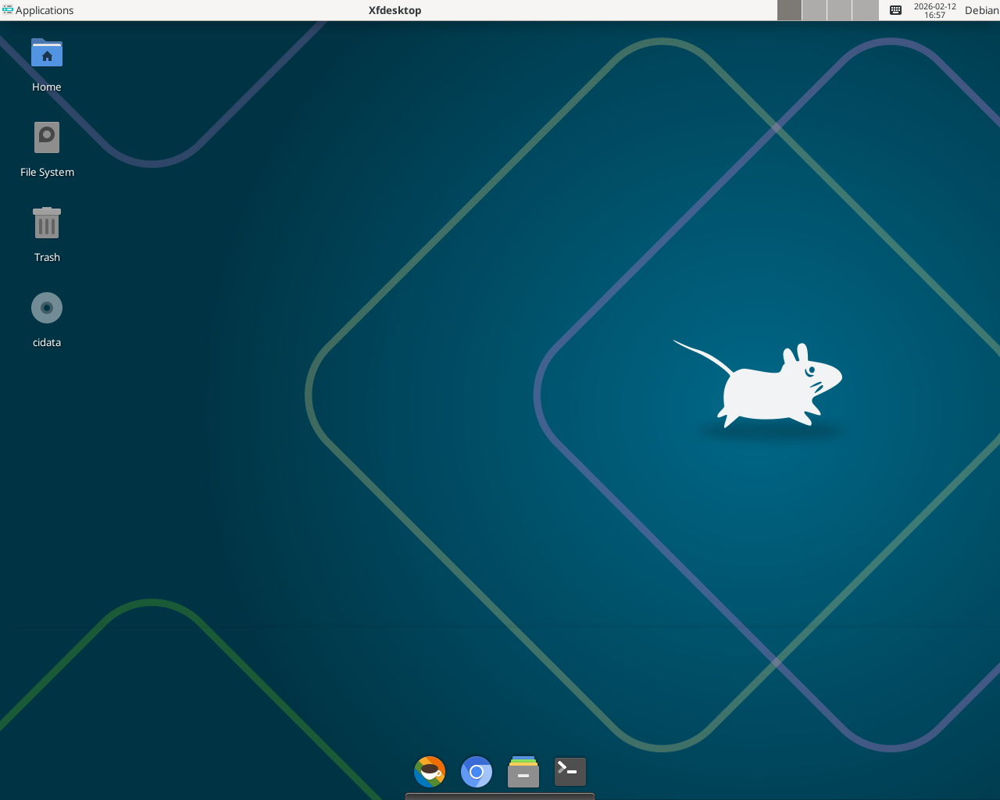

# Debian XFCE + XRDP Setup for OpenClaw

[](https://github.com/riverscn/cyber-claw/actions/workflows/integration-run.yml)

[中文 README](./README.zh-CN.md)



## Remote Desktop Experience (Best for Human-AI Collaboration)

- A remote desktop environment that is highly suitable for human-AI collaboration.
- Customized XFCE with a core macOS-like GUI experience.
- Connect through RDP for smoother performance than VNC, with clipboard sharing, file copy/paste, and audio/video transfer between hosts.
- OpenClaw is configured to auto-start XRDP support on startup, so it can work directly in the desktop environment where humans log in remotely.

## One-Line Install (curl)

You must run it on a clean installed debian 13 (trixie) cloud image.

Checkout "cloud image" at <https://www.debian.org/distrib/>, and choose the right one for you.

Or you can manually install from ISO: **select only Xfce desktop**, and **deselect all other desktop environments**.

SSH to your newly installed VM, and run:

```bash
curl -fsSL https://github.com/riverscn/cyber-claw/raw/main/install-xfce-xrdp-on-debian.sh | bash
```

This repository contains a single script that prepares a Debian machine with XFCE and XRDP, configures Chinese input (fcitx5 + pinyin), polishes the desktop, and wires OpenClaw session behavior so the final OpenClaw install can run smoothly.

After that, you can use ***Windows Remote Desktop*** or ***Windows App for Mac*** to connect your VM with IP address.

## How to Use (after installation)

1. Reboot the VM once after the script finishes.
2. Open your RDP client (Windows Remote Desktop / Windows App for Mac).
3. Connect to `<VM-IP>:3389` with your Linux username/password.
4. After login, use OpenClaw in the XFCE desktop.

### Plank (dock) usage tip

This setup uses `plank-reloaded` as the dock. To open its settings menu, hold **Ctrl** and click on the dock.

## What the Script Does

`install-xfce-xrdp-on-debian.sh` performs the following:

1. Updates apt and installs XFCE, XRDP, Xorg XRDP, helper tools (e.g. `xclip`), and fonts (including Noto CJK/Emoji).
2. Installs and configures `fcitx5` with Chinese pinyin input (keeps English as default).
3. Installs Papirus icon theme, XFCE appmenu plugin, LibreOffice, and Chromium.
4. Sets Papirus as the default icon theme inside the live XRDP session.
5. Installs `plank-reloaded` from the zquestz Debian repo and enables auto-start.
6. Configures the XFCE panel:
   - Removes `panel-2`
   - Forces `plugin-2` to be the appmenu plugin
   - Applies appmenu settings
7. Sets up OpenClaw gateway integration so OpenClaw runs in an XRDP desktop context (not a plain TTY/background context):
   - Systemd user override that checks/creates an XRDP session before starting the gateway
   - XFCE autostart entry that restarts the gateway after desktop login, binding runtime to that XRDP user session
8. Disables `lightdm` (headless/remote workflow).

At the end, it prints the manual step for installing OpenClaw.

## Requirements

- Debian-based system with `apt`
- Run with `sudo` (or as `root`)
- Network access to install packages and pull the Plank repo key

## Usage

```bash
sudo bash install-xfce-xrdp-on-debian.sh
```

The script is designed to be run once on a fresh or clean Debian instance. It will attempt to discover the target user (the user invoking `sudo`) and configure that user’s home directory for XFCE settings, autostart entries, and systemd user overrides.

## Final Manual Step (OpenClaw Install)

After the script finishes, install OpenClaw manually:

```bash
curl -fsSL https://openclaw.ai/install.sh | bash
```

## Notes

- The intended runtime model is: OpenClaw gateway should live inside the XRDP desktop session context. This avoids mismatches where GUI-related behavior runs outside the desktop session.
- The script tries to interact with a live XRDP session to apply XFCE settings reliably. If no XRDP session exists, it will attempt to create one.
- XFCE panel settings are written via `xfconf-query` in the XRDP session.
- The script disables `lightdm` by default (headless/remote workflow); if you want a local GUI login, re-enable it manually.
- The script only prompts for reboot in an interactive shell; when run non-interactively (e.g. via `curl | bash`) it will skip the prompt and tell you to reboot manually.

## Troubleshooting

- If XRDP fails to start, check:
  - `systemctl status xrdp`
  - `journalctl -u xrdp -e`
- If XFCE settings do not apply, log in once via XRDP and re-run the script.
- If `plank` does not auto-start, verify the autostart file in:
  - `~/.config/autostart/plank-reloaded.desktop`

## Files

- `install-xfce-xrdp-on-debian.sh`: main setup script
